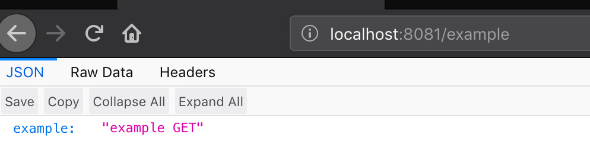
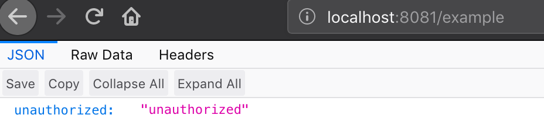
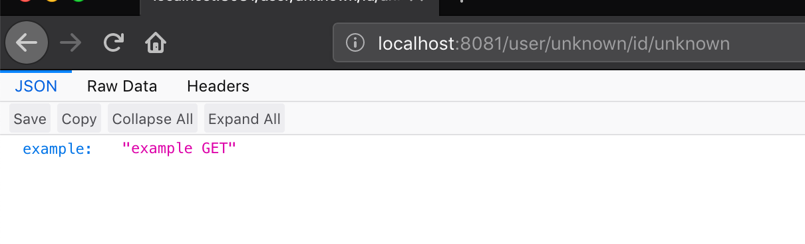
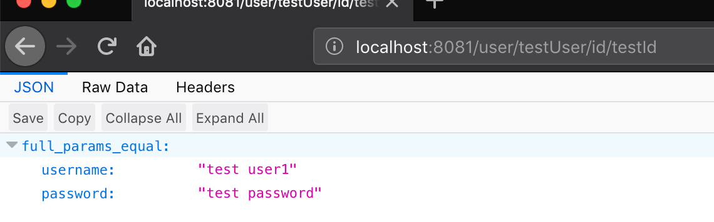
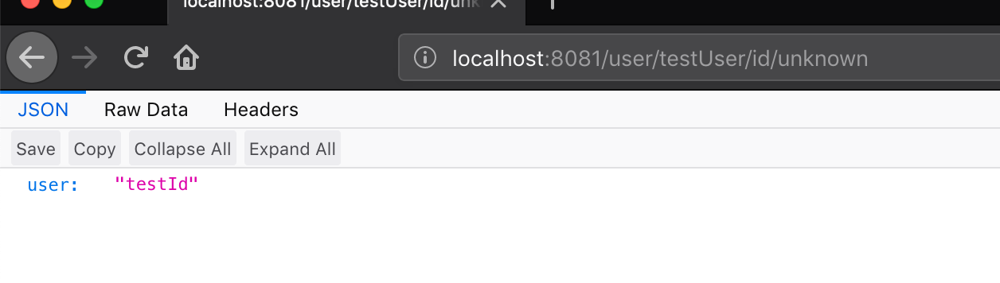
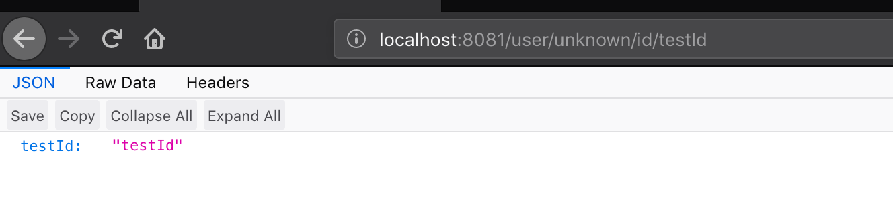
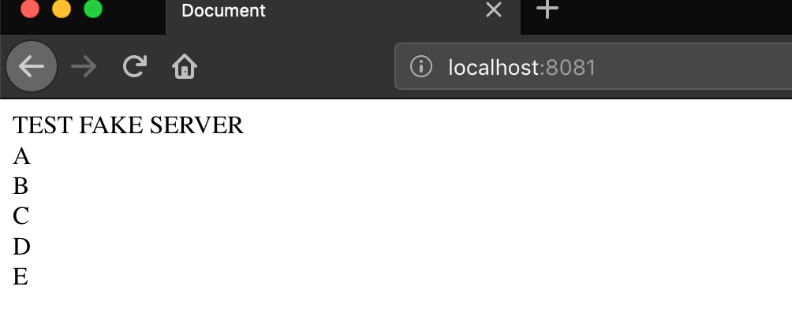

## Usage

* Build simple fake server with routing, params, static content
* GET, POST, PUT, DELETE, supported methods, status, bodies etc


## Install
```sh
npm install -SD json-fake-server || npm i -g json-fake-server
```

## Example
base usage example
```js
const fakeServer = require('json-fake-server')
const model = {
  port: 9090,
  api: [{
    method: "GET",
    path: "/",
    response: "Hello world"
  }]
}
const server = fakeServer(model)
// open browser
// url 'http://localhost:9090/
setTimeout(() => {
  server.stop()
}, 25000)
```
mocha test example
```js
const fakeServer = require('json-fake-server')
const fetch = require('node-fetch')
const {expect} = require('chai')

const model = {
  "port": 8888,
  "api": [
    {
      "method": "GET",
      "path": "/user",
      "response": {
        "user_name": "test user"
      }
    },
    {
      "method": "POST",
      "path": "/user",
      "response": {"created": true}
    }
  ]
}

describe('Example', () => {
  let server = null
  before(() => {
    server = fakeServer(model)
  })
  after(() => {
    server.stop()
  })
  it('test post user', asyn () => {
    const responseBody = await fetch('http://localhost:8888/user', {method: 'POST'}).then((res) => res.json())
    expect(responseBody.created).to.eql(true)
  })
  it('test get user', async () => {
    const responseBody = await fetch('http://localhost:8888/user').then((res) => res.json())
    expect(responseBody.user_name).to.eql('test user')
  })
})
```

## Example from command line
./test.json
```json
{
  "port": 8081,
  "host": "0.0.0.0",
  "api": [
    {
      "method": "GET",
      "path": "/example",
      "response": {
        "example": "example GET"
      }
    }
  ]
}
```

```sh
json-fake-server -m ./test.json
```

[More examples](https://github.com/potapovDim/json-fake-server/tree/new_approach/examples)


## Model Structure

- [Endpoint Model Object](#model-object)
- [HTTP methods](#http-method)
- [Authorization](#authorization)
- [Url params](#params)
- [Queries](#queries)
- [HTML static](#html)
- [Request body assertion](#request-body-assertion)
- [Several server nodes in one environment](#several-server-nodes-in-one-environment)


## Endpoint Model Object

```js
const APIModelObject =   {
  "method": "GET",                    // required field, http methods: GET, POST, PUT, DELETE
  "path": "/example/:param1/:param2", // required field, params can be presented here
  "status": 200,                      // status in option field, default is 200

   "authorization":{                  // if full server model inludes authorization property, this will take part
                                      // in our endpoint response
    "unauthorized": {                 // this property will be used as body for respose if request does not have credentials,
                                      // unauthorized is optional, default is {unauthorized: 'unauthorized'}
      "foo": "bar"
    },                                // status what will be used, it is optional, default is 401
    "status": 401,                    //
    "token":"testToken"               //
  },

  "params_response": {                // params_response is optional, it required if you want to work with
    "response": {                     // properties of this object shoulb be equal params declaration in url
        "allParamsAreEqual": {        // for example our path is "/example/:param1/:param2"
          "param1": "success",        // params_response object includes properties : param1 and param2
          "param2": "success"         // object param should have propertie "value" what will uses as a assertion
        }                             // for example  curl http://localhost:8888/example/testFirst/someItemWhatNotExists
    },                                // response will be from param1 object - { "testId": "testFirst" }
    "param1": {                       // if all params value equal our request url params we will get general response
      "value": "testFirst",           // from params_response object or it it is not exists
      "response": {                   // responses from params objects will be merged
          "testId": "testFirst"
    },
    "param1": {
      "value": "testSecond",
      "response": {
          "testId": "testSecond"
      }
    }
  },
  "request_body_equal": {             // this property will work with PUT, POST, DELETE, PATCH only
      "status": 404,
      "not_equal_response": {         // this field is optional, default is {"data": "invalid request"}
         "success": false
      },
      "expected_body": {              // request body should equal expected_body property
        "username": "test_",
        "password": "test_pass"
      }
  },
  "response": {                       // response is option field, default is {ok: 'OK'}
    "example": "example GET"
  },
}
```

## HTTP methods
```js
const fakeServer = require('json-fake-server')
const fetch = require('node-fetch')
const model =
{
  "port": 8081,
  "api": [
    {
      "method": "GET",
      "path": "/example",
      "response": {
        "example": "example GET"
      }
    },
    {
      "method": "POST",
      "path": "/example",
      "response": {
        "example": "example POST"
      }
    },
    {
      "method": "DELETE",
      "path": "/example",
      "response": {
        "example": "example DELETE"
      }
    },
    {
      "method": "PUT",
      "path": "/example",
      "response": {
        "example": "example PUT"
      }
    }
  ]
}

const server = fakeServer(model)

async function callToServer() {
  const postData = await fetch('http://localhost:8888/example', {method: 'POST'}).then((res) => res.json())
  // {example: "example POST"}
  const getData = await fetch('http://localhost:8888/example', {method: 'GET'}).then((res) => res.json())
  // {example: "example GET"}
  const putData = await fetch('http://localhost:8888/example', {method: 'PUT'}).then((res) => res.json())
  // {example: "example PUT"}
  const deleteData = await fetch('http://localhost:8888/example', {method: 'DELETE'}).then((res) => res.json())
  // {example: "example DELETE"}
}
```


## Authorization

```js
const fakeServer = require('json-fake-server')
const fetch = require('node-fetch')

const authorizationInApiObj = {
        "unauthorized": {   // this property will be used as body for respose
          "foo": "bar"      //
        },                  //
        "status": 401,      // this property will be used as unsuccess status if token is not equal
        "token":"testToken" // to this toke property value
      }

const model = {
  "port": 8081,
  "authorization": {"type": "headers"},
  "api": [
    {
      "method": "GET",
      "path": "/example",
      "response": {"example": "example GET"},
      // default properties are
      // unauthorized : {unauthorized: 'unauthorized'}
      // status : 401
      "authorization": authorizationInApiObj
    }
  ]
}
const server = fakeServer(model)

async function callToServerHeaderAuthorization() {
  const withoutTokenData = await fetch('http://localhost:8888/example', {method: 'GET'}).then((res) => res.json())
  // {foo: "bar"}
  const withTokenData = await fetch('http://localhost:8888/example', {
    headers: {Authorization: 'Bearer testToken'},
    method: 'GET'}).then((res) => res.json())
  // {example: "example GET"}
}
callToServer()
```



## Params

```js
const fakeServer = require('json-fake-server')
const fetch = require('node-fetch')

const model = {
  "port": "8081",
  "api": [{
    "method": "GET",
    // after : name of param shoulb be used in params_response object
    // lets check :user
    "path": "/user/:user/id/:id",

    "params_response": {
      "id": {
        "value": "testId",
        "response": {
          "testId": "testId"
        }
      },
      // user
      // if user will contain /user/testUser/id/:id
      // we will get next response from user object
      "user": {
        "value": "testUser",
        "response": {
          "user": "testId"
        }
      },

      // if we have full uquals between params
      // we will get general response - response property from params_response object
      // in this case we heed
      // http://localhost:8081/user/testUser/id/testId
      "response": {
        "full_params_equal": {
          "username": "test user1",
          "password": "test password"
        }
      }
    },
    // this response will be used in other cases
    // as example http://localhost:8081/user/unknown/id/unknown
    "response": {
      "example": "example GET"
    }
  }]
}
  async function callToServer() {
  const defaultGetData = await fetch('http://localhost:8081/user/unknown/id/unknown', {method: 'GET'}).then((res) => res.text())
  // {"example": "example GET"}
  console.log(defaultGetData)

  const fullPramsEqual = await fetch('http://localhost:8081/user/testUser/id/testId', {method: 'GET'}).then((res) => res.text())
  // {"full_params_equal": {
  //   "username": "test user1",
  //   "password": "test password"
  // }}
  console.log(fullPramsEqual)

  const userEqualParamEqual = await fetch('http://localhost:8081/user/testUser/id/unknown', {method: 'GET'}).then((res) => res.text())
  // {"user": "testId"}
  console.log(userEqualParamEqual)

  const idEqualParamEqual = await fetch('http://localhost:8081/user/unknown/id/testId', {method: 'GET'}).then((res) => res.text())
  // {"testId": "testId"}
  console.log(idEqualParamEqual)
}

```
<br />
Default response
<br />

<br />
Full params equal response
<br />

<br />
Partial equal param user
<br />

<br />
Partial equal param id
<br />

<br />


## Queries
```js
const fakeServer = require('../')
const fetch = require('node-fetch')

const model_obj = {
  "port": "8081",
  "api": [{
    "method": "GET",
    "path": "/test",
    "response": {
      "testOne": 1,
      "testTwo": 2,
      "testThree": 3,
      "testFour": 4,
    }
  }]
}

const model_array = {
  "port": "8082",
  "api": [{
    "method": "GET",
    "path": "/test",
    "response": [
      {
        "testOne": 1,
        "testTwo": 2,
        "testThree": 3,
        "testFour": 4,
      },
      {
        "testOne": 1,
        "testTwo": 2,
        "testThree": 3,
        "testFour": 4,
      },
      {
        "testOne": 1,
        "testTwo": 2,
        "testThree": 3,
        "testFour": 4,
      }
    ]
  }]
}

async function callToServer() {

  server_obj = fakeServer(model_obj)
  server_array = fakeServer(model_array)

  const query_resp_obj = await fetch('http://localhost:8081/test?testOne=1&testTwo=2', {method: 'GET'}).then((res) => res.text())
  // {"testOne":1,"testTwo":2}
  console.log(query_resp_obj)

  const query_resp_array = await fetch('http://localhost:8082/test?testOne=1&testTwo=2', {method: 'GET'}).then((res) => res.text())
  // [{"testOne":1,"testTwo":2},{"testOne":1,"testTwo":2},{"testOne":1,"testTwo":2}]
  console.log(query_resp_array)
}
```

## HTML

```js
const fakeServer = require('json-fake-server')
const fetch = require('node-fetch')
const path = require('path')

const indexHtml = path.resolve(__dirname, './index.html')
const model = {
  "port": "8081",
  "api": [{
    "method": "GET",
    "path": "/",
    "response": indexHtml
  }]
}
async function callToServer() {
const indexHtmlText = await fetch('http://localhost:8081/', {method: 'GET'}).then((res) => res.text())
  // <html lang="en">
  //   <head>
  //     <meta charset="UTF-8">
  //     <meta name="viewport" content="width=device-width, initial-scale=1.0">
  //     <meta http-equiv="X-UA-Compatible" content="ie=edge">
  //     <title>Document</title>
  //   </head>
  //   <body>
  //     TEST FAKE SERVER
  //     <div>A</div>
  //     <div>B</div>
  //     <div>C</div>
  //     <div>D</div>
  //     <div>E</div>
  //   </body>
  //   </html>
  console.log(indexHtmlText)
}

```


## Request body assertion
```js
const fakeServer = require('json-fake-server')
const fetch = require('node-fetch')
const model_obj = {
  "port": "8081",
  "debug": true, // if this prop exists log will show all results in console, defailt is false
  "api": [{
    "method": "POST",
    "path": "/test",
    "request_body_equal": {
      "status": 404,
      "not_equal_response": { // this field is optional, default is {"data": "invalid request"}
         "success": false
      },
      "expected_body": {
        "username": "test_",
        "password": "test_pass"
      }
    },
    "response": {
      "success": true
    }
  }]
}


const serser = fakeServer(model_obj)

async function callToServer() {

  const body_equal_success = await fetch('http://localhost:8081/test', {
    method: 'POST',
    headers: {'Content-Type': 'application/json'},
    body: JSON.stringify({"username": "test_", "password": "test_pass"})
  }).then((res) => res.text())
  // {"success":true}
  console.log(body_equal_success)

  const body_not_equal = await fetch('http://localhost:8081/test', {
    method: 'POST',
    headers: {'Content-Type': 'application/json'},
    body: JSON.stringify({
      "username": "test_1",
      "password": "test_pass"
    })
  }).then((res) => res.text())
  // {"success": false}
  console.log(body_not_equal)
  serser.stop()
}
```

## Several server nodes in one environment
```js
const fakeServer = require('json-fake-server')
const fetch = require('node-fetch')

const model_entry_point = {
  "port": 8081,
  "api": [
    {
      "method": "GET",
      "path": "/user",

      "response_from_url": { // if this property exists this endpoint will try to use it as main
        "status": 201, // response status
        "method": "GET", // method what will use for request for other HTTP service
        "url": "http://localhost:8888/userData",  // URL to other service endpoint
        "merge_with": { // if this property exists response from URL will merged with this property value
                        // for example from http://localhost:8888/userData we will get {user: "exists"}
                        // after merge with this property value {user: "exists", part_from_entrypoint: "entry point"}
                        // so after request to http://localhost:8081/user
                        // we will get {user: "exists", part_from_entrypoint: "entry point"}
          "part_from_entrypoint": "entry point"
        }
      }
    }
  ]
}

const model_user = {
  "port": 8888,
  "api": [
    {
      "method": "GET",
      "path": "/userData",
      "response": {
        "part_from_user_service": {
          "user_profile": {
            "username": "some username",
            "postal_code": 3212654
          }
        }
      }
    }
  ]
}

const entry = fakeServer(model_entry_point)
const userSerice = fakeServer(model_user)


async function callToServer() {
  const getData = await fetch('http://localhost:8081/user',
    {method: 'GET'}).then((res) => res.json())
  // {
  // part_from_user_service:
  //   { user_profile: { username: 'some username', postal_code: 3212654 } },
  //  part_from_entrypoint: 'entry point'
  //  }
  console.log(getData)
  entry.stop()
  userSerice.stop()
}
```

