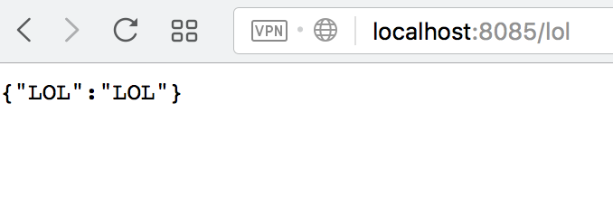

#Fork and improve
## Usage

* You can start fake server
* Mock some response (GET, POST, PUT, DELETE), if you need big response - can read it from JSON file
* Stop fake server



## Install
```sh
npm install -SD mock-backend-rest
```

```js

const FakeServer = require('mock-backend-rest');

FakeServer.port = 8085; //default port is 4000
FakeServer.get('/foo', './index.json'); //path to json file what will be response
FakeServer.post('/bar', {LOL: 'LOL'}); //
FakeServer.del('/foo', {LOL: 'LOL'});
FakeServer.put('/bar', {LOL: 'LOL'});

FakeServer.start();

console.log(FakeServer.getGetResult('/foo')); 
//output  { called: false, callCount: 0, method: 'GET' }
//curl -d '{"key1":"value1", "key2":"value2"}' -H "Content-Type: application/json" -X POST http://localhost:8085/bar
//two times use curl and after
setTimeout(() => {
  console.log(FakeServer.getPostResult('/bar'));
  FakeServer.stop();
}, 10000);
//{ calledArgs:
//   [ { key1: 'value1', key2: 'value2' },
//     { key1: 'value1', key2: 'value2' } ],
// called: true,
// callCount: 2,
// method: 'POST' }
```

methods | args
--- | ---
**`get(path, response)`** | path: `string` example: '/foo'; response: `object` or `string` - path to json filre
**`post(path, response)`** | path: `string` example: '/foo'; response: `object`or `string` - path to json filre
**`del(path, response)`** | path: `string` example: '/foo'; response: `object`  or `string` - path to json filre
**`put(path, response)`** | path: `string` example: '/foo'; response: `object` or `string` - path to json filre
**`start()`** | any args
**`stop()`** | any args, if server not started - will get message
**`port`** | setter, any or number, default is 4000
**`getDelResult(path)`** | path: `string` example '/foo', if server dont have action for this path return empty obj
**`getPutResult(path)`** | path: `string` example '/foo', if server dont have action for this path return empty obj
**`getGetResult(path)`** | path: `string` example '/foo', if server dont have action for this path return empty obj
**`getPostResult(path)`** | path: `string` example '/foo', if server dont have action for this path return empty obj

## don`t need any dependencies

##Plan 
 * [ ] foo
 * [x] bar
 * [ ] baz